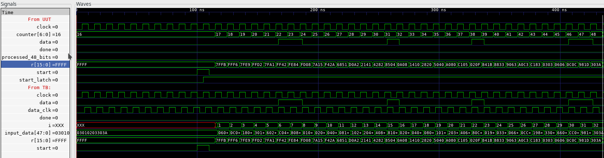
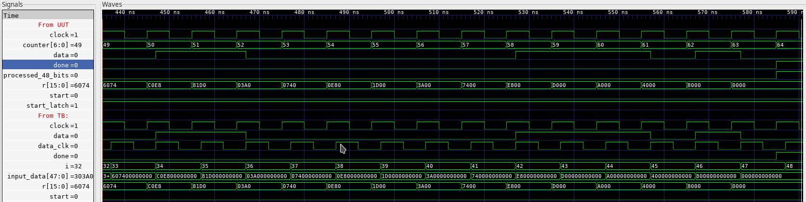

# Problem Set 6
Code:
```verilog
module lpset6(clock, start, data, done, r);
    input clock, start, data;
    output done;
    output [15:0] r;

    reg start_latch          = 1'b0;

    reg [15:0] r             = 16'hFFFF;
    // 64 - 16 = 48
    reg [6:0] counter        = 7'd16;
    
    wire processed_48_bits;

    assign processed_48_bits = counter[6];

    always @ (posedge clock)
    begin
        if (start)
        begin
            start_latch <= 1'b1;
            r           <= 16'hFFFF;
            counter     <= 7'd16;
        end
        else 
        begin
            if (start_latch & (~processed_48_bits))
            begin
                r <=  {r[15] ^ r[14] ^ data, 
                                    r[13:2], 
                        r[15] ^ data ^ r[1], 
                                       r[0], 
                               r[15] ^ data
                      };
                counter <= counter + 1;
            end
            else 
            begin
                start_latch <= 1'b0;
                // If you don't want done to stay high, uncomment below
                // counter <= 7'd16;
            end
        end
    end

    assign done = processed_48_bits;

endmodule
```

testbench:
```verilog
`timescale 1ns / 1ps
/////////////////////////////////////////////////////////////////////////////
//
// lpset CRC test bench  9/29/2017
//
/////////////////////////////////////////////////////////////////////////////

module crc_tf;

   // Inputs
   reg clock;
   reg data_clk;
   reg start;
   reg data;

   // Outputs
   wire done;
   wire [15:0] r;

   // Instantiate the Unit Under Test (UUT)
   lpset6 uut (
      .clock(clock), 
      .start(start), 
      .data(data), 
      .done(done), 
      .r(r)
   );

   // this is the input data
   reg [47:0] input_data = 48'h03_01_02_03_30_3A;
   integer i;      // required for "for" loop

   initial 
   begin   // system clock
      forever #5 clock = !clock;
   end
      
   initial 
   begin   // data_clk, ensures setup time met               
      #2
      forever #5 data_clk = !data_clk;
   end
      
   initial 
   begin
      $dumpfile("test.vcd");
      $dumpvars(0,crc_tf);
      // Initialize Inputs
      clock = 0;
      data_clk = 0;
      start = 0;
      data = 0;

      // Wait 100 ns for global reset to finish
      #100;
        
      // Add stimulus here
      start=1;
      #10 start = 0;
      #5;   // change if necessary for your design

      for (i=0; i<48; i=i+1)
      begin
         data = input_data[47];
         // at each clock, left shift the data
         // note syntax for test bench "for" loop - no "always"
         // note the blocking assignment (immediate)
         @(posedge data_clk) input_data = {input_data[46:0],1'b0};     
      end

      #5;
      $finish;
      
   end
      
endmodule

```
Screenshots:
After 32 bits are shifted in:



Once done is asserted:



